# FitFriends User Guide
*Last Updated: 7 Apr 2025*


## 🏆 Our Mission

FitFriends is designed to help **sporty young adults** connect, organize and participate in sports activities together. In today's busy world, finding friends with similar sporting interests and coordinating meetups can be challenging. FitFriends makes this process seamless and enjoyable.

*refers to adults between 16-35 years of age and are active or looking to get active in the sporting scene

### 🎯 Problems We're Solving

**Primary Challenge:**
- Difficulty in organizing sports meetups with friends who share similar interests in specific locations

**Secondary Challenges:**
- Remembering which friends play which sports
- Finding suitable locations for sports activities based on everyone's location
- Discovering conversation topics related to sports interests

### 💪 How FitFriends Helps You

- **Sports-focused contact management:** Keep track of which friends play which sports
- **Location-based planning:** Sort friends by proximity to a specific location using postal codes
- **Game organization:** Create games for different sports or friend circles
- **Smart recommendations:** Find the perfect sports partners based on interests and location

> 📊 **Did you know?** According to our surveys, 78% of young adults want to try new sports but don't know who to play with. FitFriends helps you discover which friends might be interested in picking up new sports like tennis or pickleball together!

---

## 📋 Table of Contents


- <a href="#getting-started">️️Getting Started</a>
    - [System Requirements](#system-requirements)
    - [Installation](#installation)
    - [First Launch](#first-launch)
- <a href="#using-fitfriends">️️Using FitFriends</a>
    - [Interface Overview](#interface-overview)
    - [Command Format](#command-format)
- <a href="#basic-features">️️Basic Features</a>
    - [Viewing Help](#viewing-help)
    - [Managing Contacts](#managing-contacts)
    - [Sports Management](#sports-management)
    - [Game Management](#game-management)
- <a href="#command-summary">Command Summary</a>
- <a href="#faqs">️️Faqs</a>
- <a href="#troubleshooting">️️Troubleshooting</a>
- <a href="#references">️️References</a>


---

## <a id="getting-started"></a>💻 Getting Started

### System Requirements

- **Operating System:** Windows 10/11, macOS 10.15+, or Linux
- **Java:** Version 17 or above ([Download here](https://www.oracle.com/java/technologies/downloads/))
- **Storage:** Minimum 100MB free space
- **RAM:** Minimum 2GB (4GB recommended)

### Installation

1. **Download** the latest `FitFriends.jar` file from our [releases page](https://github.com/AY2425S2-CS2103T-F12-1/tp/releases).

2. **Create a folder** where you want to store FitFriends data.

3. **Move** the downloaded `.jar` file to this folder.

### First Launch

#### Using the Command Line Interface (CLI)
###### Learn more about CLI [here](https://www.techtarget.com/searchwindowsserver/definition/command-line-interface-CLI).

1. **Open a terminal/command prompt**
    - Windows: `Win + R` > type `cmd`
    - macOS: `Cmd + Space` > type `terminal`
    - Linux: `Ctrl + Alt + T`

2. **Navigate to folder**:
   ```
   cd path/to/your/fitfriends/folder
   ```

3. **Launch the application**:
   ```
   java -jar FitFriends.jar
   ```

4. **You should see** the FitFriends interface. Congratulations! You're ready to start.

#### Using the Graphical Interface

1. **Double-click** on the FitFriends.jar file.

   > ⚠️ **If this doesn't work**: Your system might not have associated .jar files with Java. Use the CLI method above or right-click the file and select "Open with Java".

2. **You should see** the FitFriends interface. Congratulations! You're ready to start.

---
## <a id="using-fitfriends"></a> 🏋️️ Using FitFriends
### Interface Overview

FitFriends combines the power of a Command Line Interface (CLI) with the convenience of a Graphical User Interface (GUI):

- **Command Box**: Type your commands here and press <kbd>Enter</kbd> to execute
- **Result Display**: Shows the result of your command
- **Friend List**: Displays all your contacts with their information
- **Person Card**: Shows detailed information for each contact

**Before you start**, we suggest:
> 💡 **Tip**: Expand the size of the GUI window by clicking on and dragging the sides outwards, which we have done in our examples below.
> 💡 **Tip**: Switch to light and dark mode by clicking on the button at the top right of the interface.

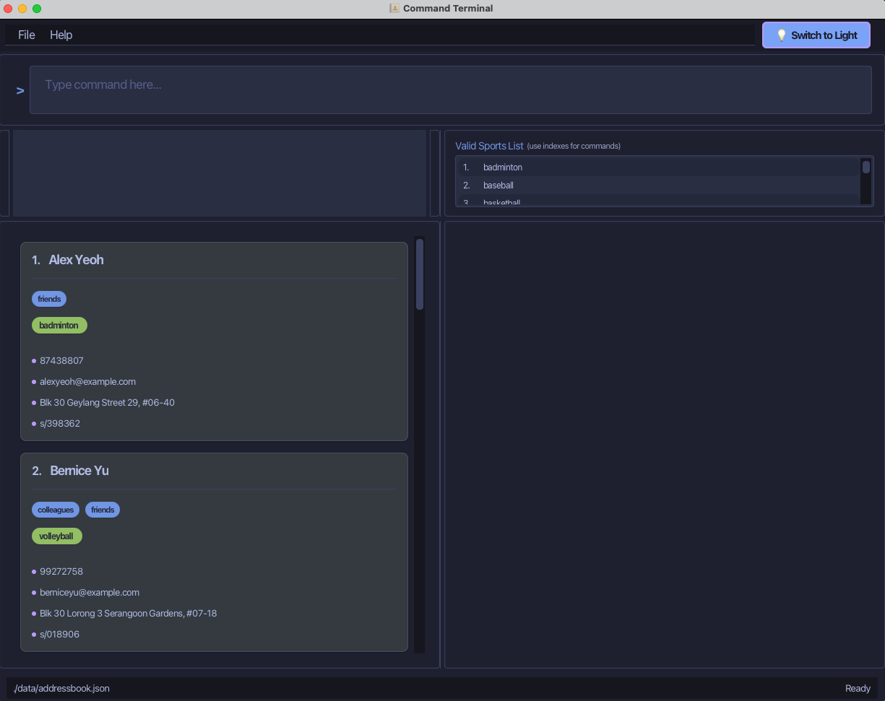
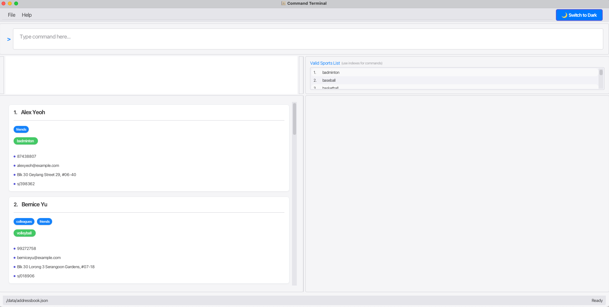


### Command Format

- Words in `UPPERCASE` are parameters to be supplied by you.
- Items in square brackets `[...]` are optional.
- Items with `...` after them can have multiple instances.
- Parameters can be in any order.

> 💡 **Tip**: Command words are case-sensitive, so you should only type `help`, and not `HELP`, `HeLp` or even `Help`.

---
## <a id="basic-features"></a> 🌟 Basic Features

### Viewing Help

Need assistance? The help command gives you quick access to instructions.

**Format**:
```
help
```

When you type `help` and press <kbd>Enter</kbd>, you'll see a message with a link to this user guide.

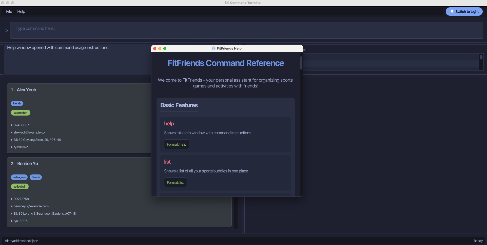

---

## Managing Contacts

### Add Contact

Add contacts to your FitFriends list with details that help plan sporting activities.

**Format**:
```
add n/NAME p/PHONE e/EMAIL a/ADDRESS [t/TAG] s/SPORT pc/POSTALCODE
```

**Example**:
```
add n/John Doe p/98765432 e/johnd@example.com a/John Street, #01-01 t/bestfriend s/tennis pc/119077
```

This adds John Doe to your list of contacts with his details and shows he plays tennis.

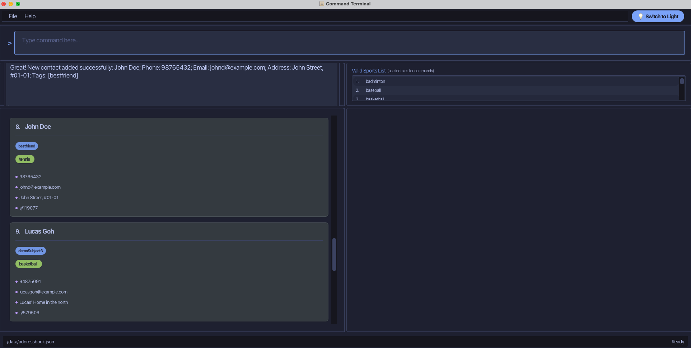

> ⚠️ **Notes**:
> * Name: Names are case-insensitive (e.g., the names, Somneel and somneel, are the same and will not be allowed when adding a contact).
> * Adding a contact places them in the alphabetically sorted position in the list.
> * "s/o" will not be accepted as part of a name, we recommend you enter this part of your contact's name as "s_o", "so" or even "s o" instead.
> * Postal Code: Only valid Singapore postal codes are accepted.
> * Sport: Only valid sports from "Valid Sports List" are allowed. You can add valid sports to this list by using the `createsport` command.
> * Tag: Tags are optional. You can add as many tags as you want to a contact (e.g., `t/bestfriend t/colleague`). Tags help you categorize your contacts.

### List All Contacts

View all your contacts in one place.

**Format**:
```
list
```

This displays all your contacts in the left panel, sorted by alphabetical order.

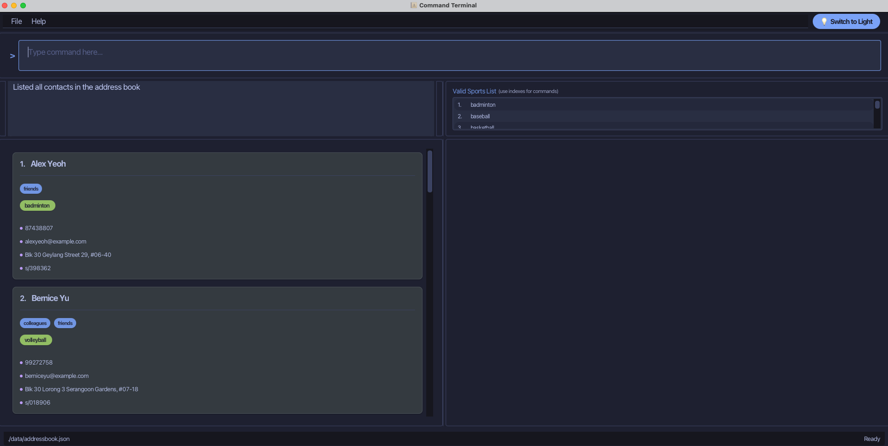

> 💡 **List Tips**:
> * You should run this command after adding, deleting or editing contacts to see the updated list.
> * You should also run this command after running find or findsport commands to view the full list.

### Edit Contact

Update your contact's details as they change.

**Format**:
```
edit INDEX [n/NAME] [p/PHONE] [e/EMAIL] [a/ADDRESS] [t/TAG] [pc/POSTALCODE]
```

**Example**:
```
edit 2 n/James Lee p/87654321 a/45 Sunset Blvd pc/119077
```

This updates the 2nd contact in your current FitFriends list with a new name, phone number, address, and postal code.

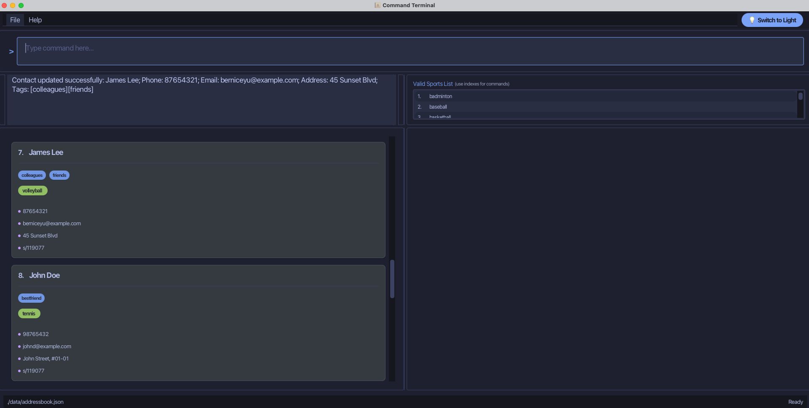

> 💡 **Edit Tips**:
> * Editing a tag will remove all existing tags as tags cannot be added sequentially (e.g., `edit t/bestfriend` followed by `edit t/colleague` will result in only the `colleague` tag remaining).
> * Adding a contact places them in the alphabetically sorted position in the list.
> * "s/o" will not be accepted as part of a name, we recommend you enter this part of your contact's name as "s_o", "so" or even "s o" instead.

### Find Contacts by Name

Quickly find contacts by searching for part of their name.

**Format**:
```
find KEYWORD [MORE_KEYWORDS]
```

**Example**:
```
find james jake
```

This will show all contacts whose names contain "James" or "Jake".

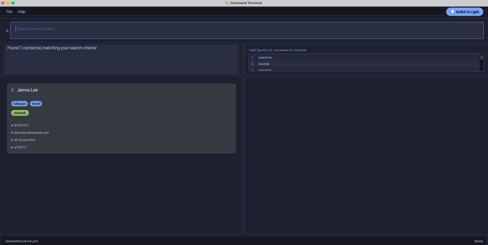

> ⚠️ **Note**:
> - Search keywords are case-insensitive
> - Order of keywords doesn't matter
> - Only full words are matched (e.g., "Han" won't match "Hans")
> - Any contact matching at least one keyword will be shown

> 💡 **Search Tip**: If you run edit, delete, addsport, deletesport commands immediately after this command, these commands will apply to the contact listed at the index as shown by the find command. Use this to manage your contacts without having to search for them manually!


### Delete Contact

Remove contacts from your FitFriends list.

**Format**:
```
delete INDEX
```

**Example**:
```
delete 3
```

This removes the 3rd contact in your current FitFriends list.

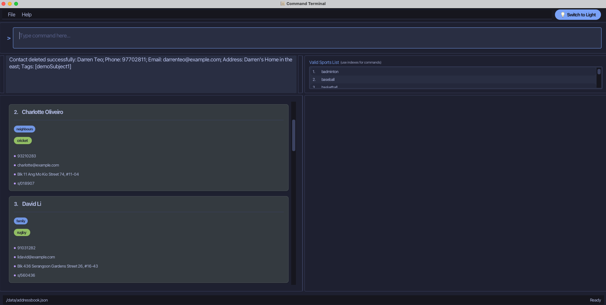

### Clear All Entries

Start fresh by removing all contacts and games from your FitFriends list.

**Format**:
```
clear
```

> ⚠️ **Warning**: This action cannot be undone. All your contacts and games will be permanently removed.

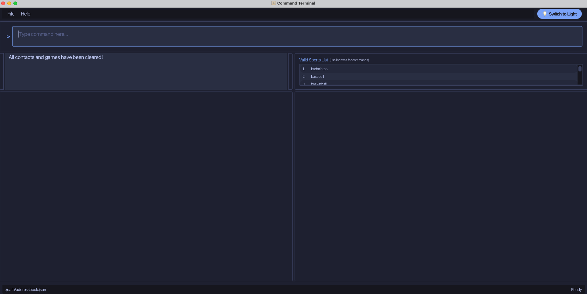

---

## Sports Management

### Add new Sport to Global List of Sports
Add new sports to the global sports list that can be added to your contacts.

**Format**:
```
createsport s/SPORT_NAME
```

**Example**:
```
createsport s/archery
```

This adds archery to the global sports list that can be assigned to your contacts.

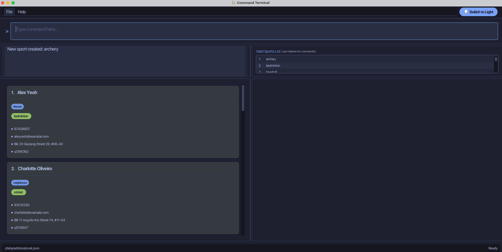

> ⚠️ **Note**:
> * Sport names entered in commands are case-insensitive and will be stored and displayed in lowercase.

### List All Sports
View all available sports in the global sports list with their indices.

**Format**:
```
listsports
```

This displays all sports in alphabetical order with numbers for reference.

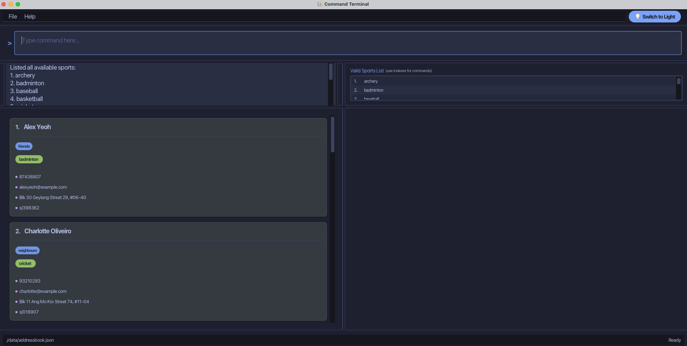

> 💡 **Tip**: Take note of the indices as they're needed when deleting sports from the global list.

### Delete Sport from Global List of Sports

Removes sport from the global sports list.

**Format**:
```
deletesport INDEX
```

**Example**:
```
deletesport 1
```

This removes the first sport in the alphabetically sorted global sports list.

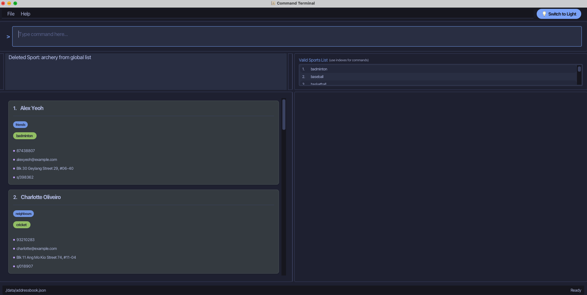

> ⚠️ **Warning**: Removing a sport from the global list means it can no longer be assigned to a contact.

### Add Sport to Contact

Record which sports your contacts play to make planning activities easier.

**Format**:
```
addsport INDEX s/SPORT
```

**Example**:
```
addsport 2 s/basketball
```

This adds basketball to the list of sports played by the 2nd contact in your current FitFriends list.


> ⚠️ **Note**:
> * You can only add one sport at a time. For multiple sports, use the command several times.
> * You can only add sports that exist in the global sports list.

### Delete Sport from Contact

Update your FitFriends list if a contact no longer plays a particular sport.

**Format**:
```
deletesport INDEX s/SPORT
```

**Example**:
```
deletesport 2 s/basketball
```

This removes basketball from the 2nd contact's list of played sports.

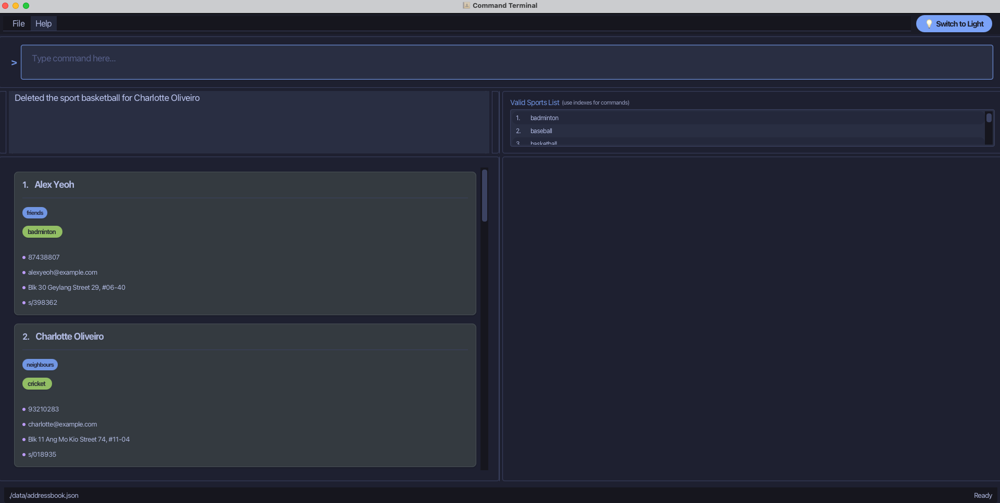

> ⚠️ **Note**:
> * This command has the same command name as deleting a sport from the global sports list. To prevent accidental deletion of sport from global sports list, ensure you add "s/SPORT" at the end of this command to delete a sport from a contact. 

### Find Contacts by Sport

Discover which contacts play specific sports—perfect for organizing game days!

**Format**:
```
findsport s/SPORT [s/SPORT]
```

**Example**:
```
findsport s/basketball s/tennis
```

This shows all contacts who play either basketball or tennis (or both).

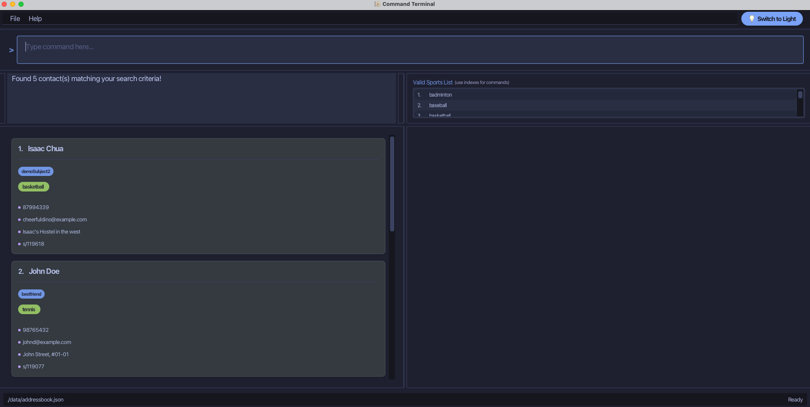

> 💡 **Pro-tip**: If you run edit, delete, addsport, deletesport commands immediately after this command, these commands will apply to the contact listed at the index as shown by the findsport command. Use this to manage your contacts without having to search for them manually!

### Find Contacts by Sport and Location

Find sports contacts near a specific location—ideal for planning convenient meetups!

**Format**:
```
findsport pc/POSTALCODE s/SPORT [s/SPORT]
```

**Example**:
```
findsport pc/119077 s/tennis s/hockey
```

This shows all contacts who play tennis or hockey, sorted by their proximity to postal code 119077.

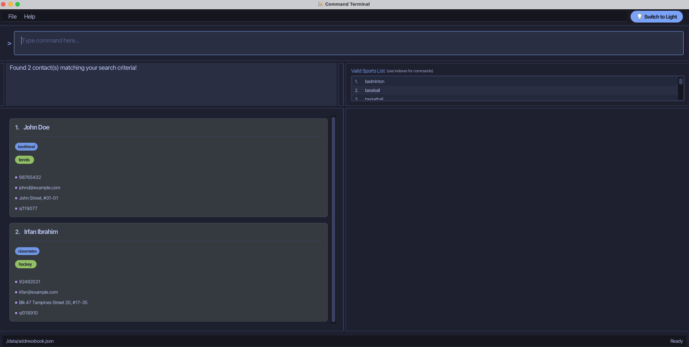

> ⚠️ **Note**:
> * Search keywords are case-insensitive
> * Proximity is calculated by contact's postal code
> * More than 1 sport can be included in the search by adding s/SPORT_NAME

> 💡 **Find Sport Tips**:
> * Use this feature to find the optimal meeting spot for your sports game!
> * If you run edit, delete, addsport, deletesport commands immediately after this command, these commands will apply to the contact listed at the index as shown by the findsport command. Use this to manage your contacts without having to search for them manually!

---

## Game Management

### Add Game

Organize your contacts into games for different activities or events.

**Format**:
```
addgame g/SPORT_NAME dt/DATE_TIME pc/POSTAL_CODE
```

**Example**:
```
addgame g/badminton dt/2025-04-01T15:00:00 pc/119077
```

This creates a new game called "badminton".


### Delete Game

Remove Games you no longer need.

**Format**:
```
deletegame INDEX
```

**Example**:
```
deletegame 1
```

This deletes the game at INDEX.


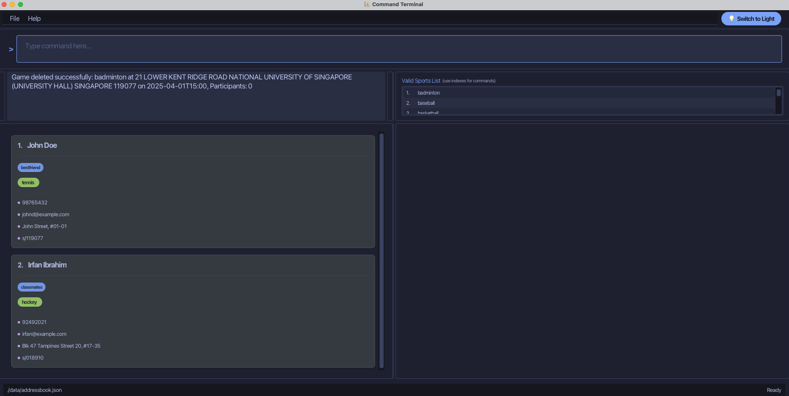


### Add Member to Game

Adds contacts as members to a particular game

**Format**:
```
addmember g/INDEX n/PERSON_NAME
```

**Example**:
```
addmember g/1 n/Mary Jane
```

### Delete Member from Game

Delete members from a particular game

**Format**:
```
deletemember g/INDEX n/PERSON_NAME
```

**Example**:
```
deletemember g/1 n/Mary Jane
```

### Edit Location of Game

**Format**:

Changes the location of an existing game
```
editgamelocation g/INDEX pc/POSTAL_CODE
```

**Example**:
```
editgamelocation g/1 pc/119077
```
---

## <a id="command-summary"></a>📝 Command Summary

| **Action**                   | **Format**                                                                    | **Example**                                                                           |
|------------------------------|-------------------------------------------------------------------------------|---------------------------------------------------------------------------------------|
| **Viewing Help**                     | `help`                                                                        | `help`                                                                                |
| **Add Contact**               | `add n/NAME p/PHONE e/EMAIL a/ADDRESS [t/TAG] s/SPORT pc/POSTALCODE`          | `add n/John Doe p/98765432 e/johnd@example.com a/John St t/friend s/tennis pc/119077` |
| **List All Contacts**             | `list`                                                                        | `list`                                                                                |
| **Edit Contact**              | `edit INDEX [n/NAME] [p/PHONE] [e/EMAIL] [a/ADDRESS] [t/TAG] [pc/POSTALCODE]` | `edit 2 n/James Lee p/98765432 a/Block 123 pc/119077`                                 |
| **Find Contacts by Name**             | `find KEYWORD [MORE_KEYWORDS]`                                                | `find James Jake`                                                                     |
| **Delete Contact**            | `delete INDEX`                                                                | `delete 3`                                                                            |
| **Clear All Entries**                | `clear`                                                                       | `clear`                                                                               |
| **Add new Sport to Global List of Sports**             | `createsport s/SPORT_NAME`                                                    | `createsport s/archery`                                                               |
| **List All Sports**              | `listsports`                                                                  | `listsports`                                                                          |
| **Delete Sport from Global List of Sports**      | `deletesport INDEX`                                                           | `deletesport 1`                                                                       |
| **Add Sport to Contact**                | `addsport INDEX s/SPORT`                                                      | `addsport 1 s/tennis`                                                                 |
| **Delete Sport from Contact**             | `deletesport INDEX s/SPORT`                                                   | `deletesport 2 s/basketball`                                                          |
| **Find Contacts by Sport**            | `findsport s/SPORT [s/SPORT]`                                                 | `findsport s/basketball s/tennis`                                                     |
| **Find Contacts by Sport and Location** | `findsport pc/POSTALCODE s/SPORT [s/SPORT]`                                   | `findsport pc/119077 s/tennis s/hockey`                                                 |
| **Add Game**                 | `addgame g/SPORT_NAME dt/DATE_TIME pc/POSTAL_CODE`                            | `addgame g/volleyball dt/2025-04-04T15:30:00 pc/119077`                               |
| **Delete Game**              | `deletegame INDEX`                                                          | `deletegame 1`                                                                      |
| **Add Member to Game**               | `addmember g/INDEX n/PERSON_NAME`                                             | `addmember g/1 n/Alice Pauline`                                                       |
| **Delete Member from Game**            | `deletemember g/INDEX n/PERSON_NAME`                                          | `deletemember g/1 n/Alice Pauline`                                                    |
| **Edit Location of Game**            | `editgamelocation g/INDEX pc/POSTAL_CODE`                                          | `editgamelocation g/1 pc/119077`                                                    |


---
## <a id="faqs"></a>🙋 FAQs

**Q: Can I use FitFriends to find sports facilities?**
A: Currently, FitFriends doesn't directly provide information about sports facilities, but it helps you coordinate with friends who live near specific locations by using findsport with postal codes.

**Q: How many sports can I add per friend?**
A: There is no limit! Add as many sports as your friend plays.

**Q: Can I import contacts from my phone?**
A: This feature is coming in our next update. Stay tuned!

---
## <a id="troubleshooting"></a>🛠️ Troubleshooting

**Problem: FitFriends won't start**
- Verify you have Java 17+ installed by running `java -version` in your terminal, if the version is correct, a message like this should appear: `java version "17.0.13" 2024-10-15 LTS`
- Try running FitFriends from the command line to see error messages and describe your problem to a generative AI model like ChatGPT.

**Problem: Command not recognized**
- Check your spelling and format
- Refer to the Command Summary table for correct syntax

**Still need help?** Visit our [support page](https://github.com/AY2425S2-CS2103T-F12-1/tp/issues) or email `fitfriends.support@gmail.com`.

---
## <a id="references"></a>📚 References

1. [Benefits of sports in social bonding](https://www.ncbi.nlm.nih.gov/pmc/articles/PMC6125028/)
2. [The importance of location in sports participation](https://www.tandfonline.com/doi/full/10.1080/16184742.2019.1566931)
3. [Java documentation](https://docs.oracle.com/en/java/)

---

[Back to Top](#fitfriends-user-guide)
